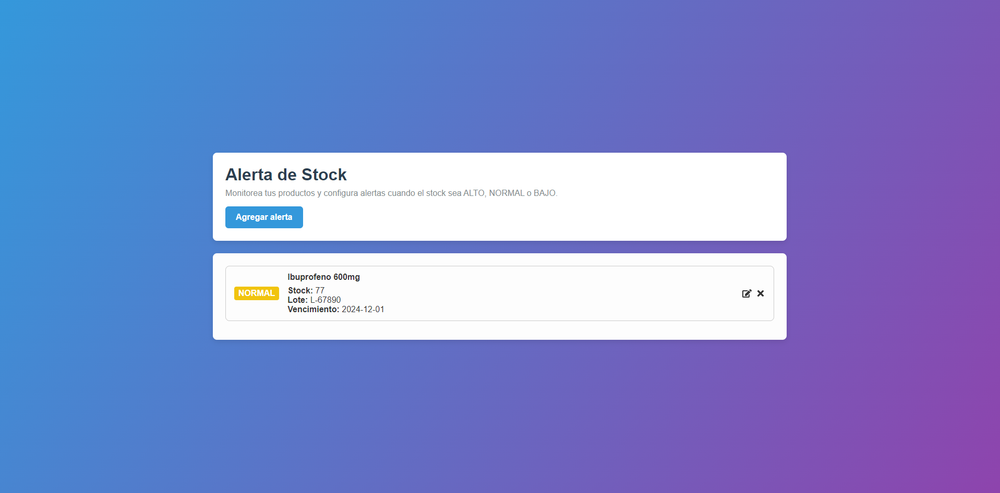
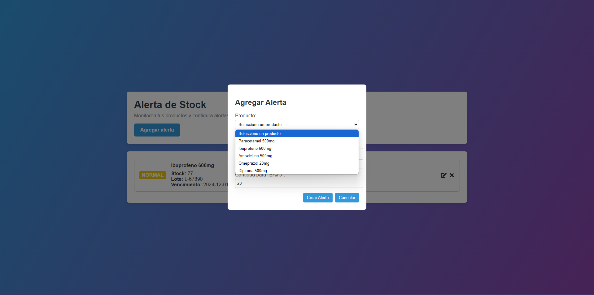

# Alerta de Stock

## Overview
**Alerta de Stock** is a React + TypeScript application that helps you monitor product inventory levels. Users can set custom thresholds (HIGH, NORMAL, LOW) for each product, and receive alerts whenever stock levels change.

## Features
- **Add Alerts**: Configure thresholds (HIGH, NORMAL, LOW) for each product.
- **Edit Alerts**: Adjust existing alerts at any time.
- **Avoid Duplicates**: The app prevents creating multiple alerts for the same product.
- **Delete Alerts**: Remove alerts that are no longer needed.
- **Visual Indicators**: Alerts are labeled with color badges indicating stock levels.

## Setup
1. **Clone the repository**  
   ```bash
   git clone https://github.com/darioalbor/alert-stock.git
   ```
2. **Install dependencies**  
   ```bash
   cd alert-stock
   npm install
   ```
   or
   ```bash
   yarn
   ```
3. **Run the app in development mode**  
   ```bash
   npm start
   ```
   or
   ```bash
   yarn start
   ```
   The app will open at [http://localhost:3000](http://localhost:3000).

## Usage
1. **View Products**: The home page displays the current alerts and their stock levels.
2. **Add/Configure Alert**: Click “Add alert” to open the configuration modal, select a product, and set thresholds.
3. **Edit Alert**: Click the pencil icon to modify an existing alert’s thresholds.
4. **Delete Alert**: Click the “X” icon to remove an alert.

## Screenshots

|  |
|:-----------------------:|
| **ALERTS**             |

|  |
|:----------------------------------:|
| **ADD/CONFIG ALERTS**             |
```
